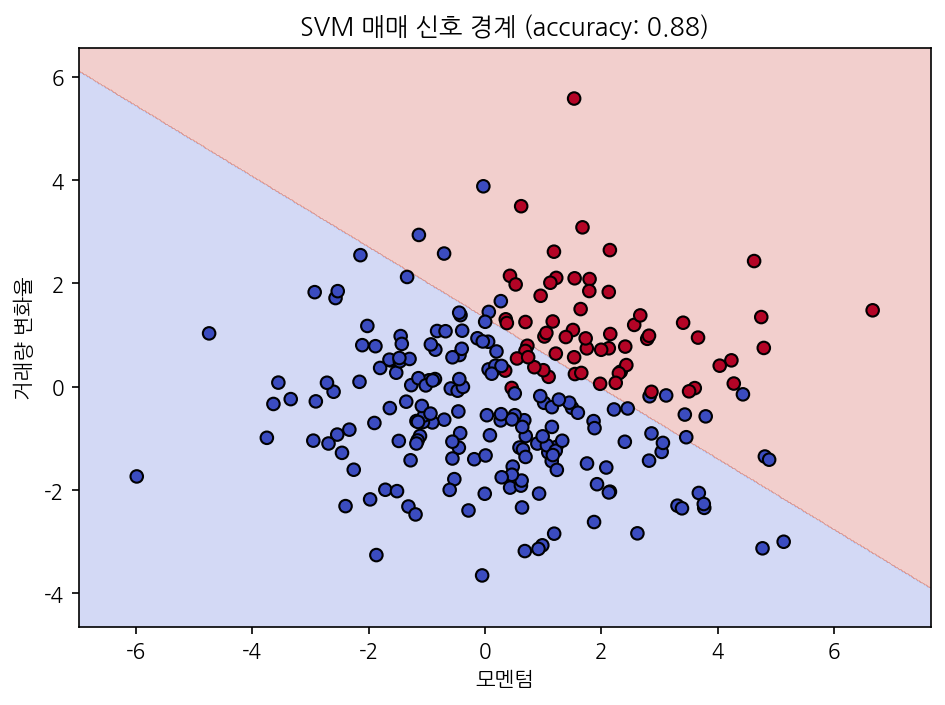
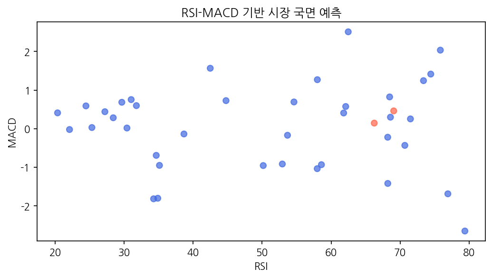
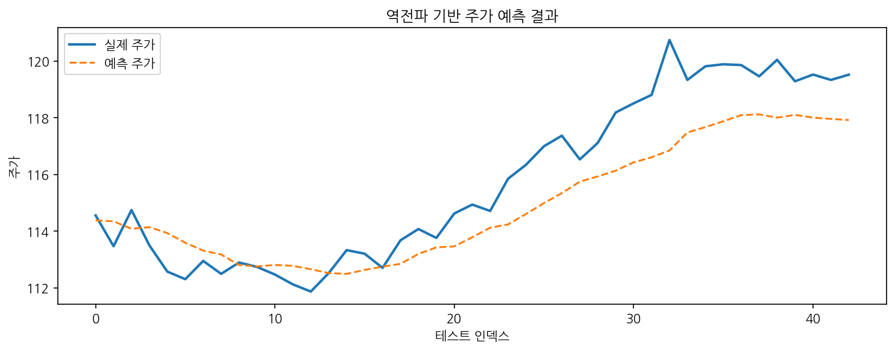
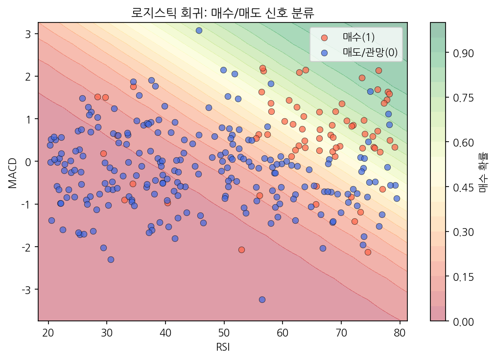

# Python 주식투자 머신러닝 실습 커리큘럼

이 저장소는 Python 기초부터 머신러닝/딥러닝까지 **주식투자 데이터 분석** 중심으로 학습하도록 구성되어 있습니다.

---

# 딥러닝(DL)과 머신러닝(ML)의 작동 원리 이해

## 1. 머신러닝/딥러닝의 알고리즘은 모두 오차를 줄이기 위한 것인가?

결론부터 말하자면, **대부분 맞습니다.**

머신러닝과 딥러닝의 핵심 목표는 **"컴퓨터가 정답과 예측값 사이의 차이(오차)를 최대한 줄이게 만드는 것"** 입니다.

> **🎯 쉬운 예시: 과녁 맞히기**
> 처음 화살을 쏘면 과녁 중심에서 멀리 빗나갑니다(오차가 큼).
> 빗나간 거리를 보고 "조금 더 오른쪽으로, 조금 더 위로" 하며 교정합니다.
> 여러 번 반복할수록 과녁 중심에 가까워집니다.
> 머신러닝도 똑같이 틀린 만큼 스스로 교정하며 점점 정확해집니다.

하지만 문제의 종류에 따라 접근 방법이 다릅니다.

---

### ① 지도 학습 (Supervised Learning): 정답지가 있는 공부

* **대상:** 선형 회귀, 로지스틱 회귀, 이미지 분류 딥러닝 등
* **원리:** 모델이 예측한 값과 실제 정답을 비교해 오차를 줄입니다.
* **손실 함수 (Loss Function):** 오차를 숫자로 나타내는 공식입니다.
* **최적화 (Optimization):** 오차를 0에 가깝게 줄여나가는 방법입니다.

> **📚 쉬운 예시: 선생님이 채점해주는 시험**
> 학생(모델)이 시험을 봅니다 → 선생님(정답지)이 채점합니다 → 틀린 문제를 다시 공부합니다.
> 이 과정을 반복하면 점수(정확도)가 올라갑니다.
>
> 주식 예시: "삼성전자 주가가 내일 오를까 내릴까?" 라는 문제를 풀고, 실제 결과와 비교해 계속 교정합니다.

---

### ② 비지도 학습 (Unsupervised Learning): 정답지 없이 스스로 분류

* **대상:** 군집화(Clustering), 차원 축소(PCA) 등
* **원리:** 정답 없이 데이터 안에서 비슷한 것끼리 묶거나 패턴을 찾습니다.

> **🍎 쉬운 예시: 과일 분류하기**
> 사과, 바나나, 포도가 섞여 있는 바구니에서 아무도 "이게 사과야"라고 알려주지 않아도,
> 모양·색깔·크기가 비슷한 것끼리 스스로 그룹을 만듭니다.
>
> 주식 예시: 수천 개 주식을 "움직임이 비슷한 종목끼리" 자동으로 묶어 분류합니다.

---

### ③ 강화 학습 (Reinforcement Learning): 게임처럼 점수를 높이기

* **대상:** 알파고, 자율주행 등
* **원리:** 행동할 때마다 점수(보상)를 받고, 점수를 최대로 높이는 전략을 배웁니다.

> **🎮 쉬운 예시: 비디오 게임**
> 게임 캐릭터가 적을 잡으면 +10점, 떨어지면 -5점.
> 점수를 올리려면 어떻게 움직여야 할지 수천 번 게임을 해보며 스스로 배웁니다.
>
> 주식 예시: AI가 "주식을 살 때"와 "팔 때"를 수없이 시도하며, 수익이 나는 전략을 스스로 터득합니다.

---

## 2. 딥러닝(DL)은 선형회귀를 순차·역순차로 계속 반복하는 것인가?

**정확한 핵심입니다!**

딥러닝은 **"간단한 계산(선형회귀)을 엄청나게 많이 쌓아 올린 뒤, 앞으로 계산하고(순전파) → 뒤로 고치는(역전파) 과정을 반복"** 하는 것입니다.

---

### ① '선형 회귀'를 거대하게 쌓기 (인공신경망)

선형 회귀의 기본 공식:
$$\text{Output} = WX + b$$
(입력값 $X$에 가중치 $W$를 곱하고 편향 $b$를 더함)

딥러닝의 최소 단위인 **퍼셉트론(Perceptron)**이 이 공식과 똑같이 작동합니다.
딥러닝은 이 계산 단위를 수천, 수만 개 연결한 거대한 그물망입니다.

> **🧱 쉬운 예시: 레고 블록 쌓기**
> 레고 블록 하나(선형회귀) 혼자는 단순한 모양만 만들 수 있습니다.
> 하지만 수천 개를 조립하면(딥러닝) 로봇·성·자동차 같은 복잡한 것도 만들 수 있습니다.

> **💡 비선형 활성화 함수 (Activation Function)**
> 레고 블록만 단순히 쌓으면 결국 직선 모양밖에 안 됩니다.
> 중간에 **ReLU·시그모이드 같은 "꺾는 함수"** 를 끼워 넣으면 구불구불한 곡선도 표현할 수 있습니다.
> 현실 세계의 복잡한 주가 패턴도 이렇게 표현합니다.

---

### ② '앞으로' 계산하기: 순전파 (Forward Propagation)

* **방향:** 입력층 → 은닉층 → 출력층 (앞으로 전진)
* **역할:** 입력 데이터를 받아 최종 예측값을 만들고, 정답과 비교해 오차를 계산합니다.

> **📖 쉬운 예시: 시험 문제 풀기**
> 문제를 읽고(입력) → 생각하고(은닉층) → 답을 씁니다(출력).
> 채점하면 몇 점 틀렸는지(오차) 알 수 있습니다.

---

### ③ '뒤로' 고치기: 역전파 (Backpropagation)

* **방향:** 출력층 → 은닉층 → 입력층 (뒤로 후진)
* **역할:** 오차를 거꾸로 추적하며 각 계산 단위가 얼마나 틀림에 기여했는지 파악하고, 가중치를 조금씩 수정합니다.

> **✏️ 쉬운 예시: 시험 오답 노트**
> 틀린 문제를 다시 보며(역방향) → "어디서 실수했지?" 추적 → 그 부분을 집중 공부(가중치 수정).
> 이 과정을 반복하면 점점 더 잘 풀게 됩니다.

---

### ④ 무한 반복 (Epoch / Iteration)

순전파(문제 풀기)와 역전파(오답 노트)를 수천, 수만 번 반복하면서 최적의 예측 모델이 완성됩니다.

> **🏋️ 쉬운 예시: 운동 연습**
> 농구 자유투를 처음엔 잘 못 넣습니다.
> 매일 100번씩 던지고(순전파), 어떻게 틀렸는지 교정하며(역전파) 연습합니다.
> 수천 번 반복하면 거의 다 넣을 수 있게 됩니다.

---

## 요약

| 개념 | 쉬운 비유 |
|------|----------|
| 머신러닝 | 틀린 만큼 반성하며 공부하는 학생 |
| 지도 학습 | 정답지가 있는 시험 공부 |
| 비지도 학습 | 정답 없이 비슷한 것끼리 스스로 묶기 |
| 강화 학습 | 점수를 높이려고 게임을 계속 연습하기 |
| 딥러닝 | 레고 블록 수만 개를 쌓은 거대한 계산기 |
| 순전파 | 시험 문제 풀기 |
| 역전파 | 오답 노트 작성 |
| 반복 학습(Epoch) | 매일 꾸준히 연습하기 |

딥러닝은 **비선형성이 추가된 선형 회귀들의 거대한 조립품**이며, **순전파(문제 풀기)와 역전파(오답 노트)라는 시계추 운동**을 반복해 점점 정확해지는 과정입니다.

---

## 파일별 설명

### 1) 기초 데이터 처리

- [NumpyStockArray.py](NumpyStockArray.py): 주가 배열, 수익률/변동성 계산, 포트폴리오 기대수익률
  > 예시: "삼성전자가 100일 동안 어떻게 올랐나?" 를 숫자 배열로 계산합니다.

- [PandasPortfolio.py](PandasPortfolio.py): 포트폴리오 결측치 처리, 평가금액/수익률 계산, 섹터별 집계
  > 예시: 주식 거래 기록표에서 빠진 날짜를 채우고, 내 수익률을 표로 정리합니다.

### 2) 회귀 (지도 학습)

- [LinearRegressionReturn.py](LinearRegressionReturn.py): 거래량/변동성 기반 다음 날 수익률 예측
  > 예시: "오늘 거래량이 많으면 내일 주가가 얼마나 오를까?" 를 직선으로 예측합니다.

- [LinearRegressionFundamental.py](LinearRegressionFundamental.py): PER/PBR/ROE 기반 기대수익률 예측
  > 예시: 회사의 성적표(PER, PBR, ROE)를 보고 "이 주식이 얼마나 오를지" 예측합니다.

- [LogisticTradeSignal.py](LogisticTradeSignal.py): RSI/MACD 기반 매수/매도 신호 확률 분류 *(로지스틱 회귀)*
  > 예시: "RSI 65, MACD 양수 → 매수 확률 78%" 처럼 확률로 매매 신호를 출력합니다.

### 3) 분류 모델링 (지도 학습)

- [SvmTradeSignal.py](SvmTradeSignal.py): 모멘텀/거래량 변화율 기반 매수/매도 신호 분류 *(SVM)*
  > 예시: 두 지표를 보고 "지금 사야 할지, 팔아야 할지" 선 하나로 딱 나눕니다.

- [SvmMarketPhase.py](SvmMarketPhase.py): RSI/MACD/변동성 기반 시장 국면(상승/하락) 분류 *(SVM RBF)*
  > 예시: 4가지 지표를 보고 "지금 시장이 오르는 중인지 내리는 중인지" 판단합니다.

### 4) 비지도 학습

- [KMeansStockCluster.py](KMeansStockCluster.py): 수익률/변동성 기반 주식 유형 자동 군집화 *(K-Means)*
  > 예시: 아무도 가르쳐 주지 않아도 60개 종목을 성장주/가치주/방어주로 스스로 분류합니다.

- [PcaStockReduce.py](PcaStockReduce.py): 6가지 주식 지표를 2차원으로 압축해 시각화 *(PCA)*
  > 예시: PER·PBR·ROE·변동성 등 6가지 숫자를 딱 2개로 줄여서 그래프에 표시합니다.

### 5) 자연어 처리

- [TfidfNewsFeature.py](TfidfNewsFeature.py): 투자 뉴스 문장 TF-IDF 특징 추출
  > 예시: 뉴스에서 "급등", "실적" 같은 중요한 단어를 숫자로 바꿉니다.

- [Word2VecEmbedding.py](Word2VecEmbedding.py): 투자 뉴스 토큰 임베딩 및 유사 단어 탐색
  > 예시: "반도체"와 "삼성"이 뉴스에서 자주 같이 나온다면 두 단어를 가깝게 배치합니다.

### 6) 딥러닝 & 시각화

- [NeuralNetBackprop.py](NeuralNetBackprop.py): 역전파를 직접 구현한 시계열 주가 예측 *(신경망)*
  > 예시: 오답 노트(역전파)를 손으로 직접 구현해 과거 5일 주가로 내일을 예측합니다.

- [HeatmapRiskMask.py](HeatmapRiskMask.py): 수익률 히트맵에서 고위험 구간 마스킹
  > 예시: 주가 수익률을 색깔 지도로 그리고, 위험한 구간을 빨간색으로 표시합니다.

---

## 실행 방법

```bash
python3 -m venv venv
source venv/bin/activate
pip install -r requirements.txt
sudo apt install fonts-nanum
python -m pip install --upgrade pip
pip install pylint
```

## 결과 이미지 설명 (result 폴더)

각 파일을 실행하면 `result/` 폴더에 이미지가 저장됩니다. 아래에서 각 이미지가 무엇을 보여주는지 쉽게 설명합니다.

---

### SvmTradeSignal.png — SVM 매매 신호 경계선



**무엇을 보여주나요?**
그래프가 **분홍색 구역**과 **파란색 구역**으로 나뉘어져 있고, 가운데 대각선이 경계선입니다.

- **빨간 점** = 매수 신호 (사야 할 타이밍)
- **파란 점** = 매도/보류 신호 (팔거나 기다려야 할 타이밍)
- **대각선 경계** = SVM이 찾아낸 "사야 할지 말아야 할지" 기준선

> 모멘텀이 높고(오른쪽) 거래량 변화율이 높을(위쪽) 수록 매수 신호가 됩니다.
> 정확도 **0.88** = 100번 중 88번 올바르게 판단합니다.

---

### SvmMarketPhase.png — RSI/MACD 기반 시장 국면 예측



**무엇을 보여주나요?**
가로축은 RSI(과매수/과매도 지표), 세로축은 MACD(추세 강도 지표)입니다.

- **빨간 점** = 상승장으로 예측된 날
- **파란 점** = 하락장으로 예측된 날

> RSI가 높고(60 이상) MACD가 양수일 때 빨간 점이 집중되어 있습니다.
> "시장이 강세일 때는 두 지표가 모두 높다"는 패턴을 SVM이 학습했습니다.

---

### NeuralNetBackprop.png — 신경망 역전파 주가 예측 결과



**무엇을 보여주나요?**
파란 실선(실제 주가)과 주황 점선(예측 주가)을 비교합니다.

- **실선(파랑)** = 실제로 주가가 움직인 경로
- **점선(주황)** = 신경망이 "이렇게 움직일 것"이라고 예측한 경로

> 두 선이 비슷하게 올라가는 추세를 따라가면서, 급격한 봉우리는 살짝 뭉개집니다.
> 이것이 정상입니다 — 신경망은 **전체적인 방향(추세)**은 잘 잡지만, **단기 급등락**은 놓칩니다.
> 신경망이 충분히 학습되었다면 점선이 실선에 더 가까워집니다.

---

### HeatmapRiskMask.png — 수익률 히트맵 & 고위험 마스킹


**무엇을 보여주나요?**
3개 패널이 나란히 있습니다. 각 칸은 "특정 날짜의 특정 종목 수익률"입니다.

| 패널 | 내용 |
|------|------|
| **왼쪽 (원본)** | 초록=수익, 빨강=손실로 색칠한 원본 수익률 지도 |
| **가운데 (마스크)** | 수익률이 ±2% 초과인 위험 칸만 **흰색**으로 표시 |
| **오른쪽 (강조)** | 위험 칸을 더 진한 빨강/초록으로 강조해 한눈에 보이게 함 |

> 가운데 패널에서 **흰색 칸이 많을수록** 그날 시장이 불안정했다는 뜻입니다.
> 이 기법을 쓰면 위험한 구간을 자동으로 골라낼 수 있습니다.

---

### KMeansStockCluster.png — K-Means 주식 유형 자동 분류


**무엇을 보여주나요?**
아무 힌트 없이 60개 종목을 컴퓨터가 스스로 3그룹으로 나눈 결과입니다.

- **빨간 점 (성장주)** = 오른쪽 위: 수익률 높고 변동성도 높음
- **파란 점 (가치주)** = 가운데: 수익률·변동성 모두 중간
- **초록 점 (방어주)** = 왼쪽 아래: 수익률 낮지만 변동성도 낮음
- **검정 X** = 각 그룹의 중심점(centroid)

> 아무도 "이게 성장주야"라고 가르쳐주지 않았는데, K-Means가 스스로 비슷한 종목끼리 묶었습니다.
> 이것이 **비지도 학습**의 힘입니다.

---

### PcaStockReduce.png — PCA 차원 축소 결과


**무엇을 보여주나요?**
2개 패널이 나란히 있습니다.

**왼쪽 (설명 분산 비율)**
- 파란 막대 = 각 주성분(PC)이 전체 정보의 몇 %를 담고 있는지
- 빨간 계단선 = 앞에서부터 더했을 때 누적 정보량
- PC1이 약 38%, PC2가 약 29%를 담아, **두 개만으로도 66%** 이상 정보 보존

**오른쪽 (2D 압축 산점도)**
- 원래 6개 지표를 딱 **2개 숫자(PC1, PC2)**로 압축해서 한 화면에 표시
- 색깔 = 수익률 (초록=높음, 빨강=낮음)

> 6차원을 2차원으로 줄였는데도 수익률 높은 종목(초록)과 낮은 종목(빨강)이 구분됩니다.
> 정보를 최대한 살리면서 압축하는 것이 PCA의 목적입니다.

---

### LogisticTradeSignal.png — 로지스틱 회귀 매수/매도 확률



**무엇을 보여주나요?**
배경 색깔이 그라데이션으로 칠해져 있고, 그 위에 실제 매수/매도 신호 점들이 찍혀 있습니다.

- **배경 초록 구역** = 이 위치에서는 "매수 확률이 높다"
- **배경 빨간 구역** = 이 위치에서는 "매도/관망 확률이 높다"
- **빨간 점** = 실제 매수 신호 데이터
- **파란 점** = 실제 매도/관망 데이터

> 선형 회귀가 "주가가 얼마나 오를지 숫자"를 예측한다면,
> 로지스틱 회귀는 "매수할 확률이 몇 %인지"를 예측합니다.
> RSI가 높고(오른쪽) MACD가 양수(위)일 때 초록 배경이 짙어지는 것을 볼 수 있습니다.
