<link rel="stylesheet" href="https://cdnjs.cloudflare.com/ajax/libs/font-awesome/6.5.2/css/all.min.css" />

# Python 주식투자 머신러닝 실습 커리큘럼
 
> Python 기초부터 Transformer 딥러닝까지 — **주식투자 데이터 분석**을 주제로 단계별로 학습합니다.

---

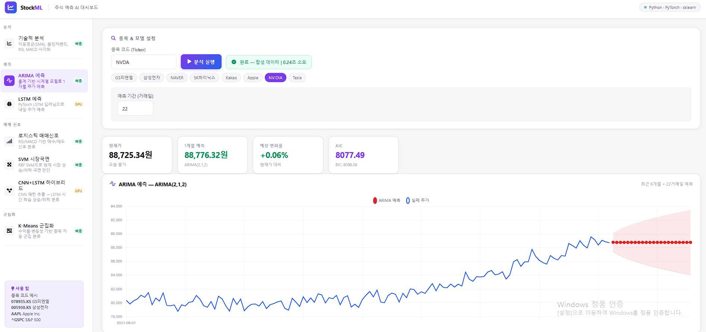

---

## <i class="fa-solid fa-folder"></i> 프로젝트 구조

```
python-ml-class/
├── src/                    ← 모든 Python 실습 파일
│   ├── korean_font.py      ← 한글 폰트 유틸리티 (모든 파일이 공통 사용)
│   ├── NumpyStockArray.py
│   ├── PandasPortfolio.py
│   ├── ... (총 23개)
│
├── docs/                   ← 각 소스 파일의 초등학생 수준 설명 문서
│   ├── NumpyStockArray.md
│   ├── PandasPortfolio.md
│   ├── ... (총 23개)
│   └── CloudMlMapping.md   ← 전체 커리큘럼의 AWS/GCP 클라우드 대응 가이드
│
├── result/                 ← 실행 후 자동 저장되는 PNG + MD 분석 파일
│   ├── NumpyStockArray.png
│   ├── NumpyStockArray.md
│   ├── ... (총 44개)
│
├── requirements.txt        ← 필요한 라이브러리 목록
└── Readme.md               ← 이 파일
```

---

## <i class="fa-solid fa-rocket"></i> 빠른 시작 (Quick Start)

### 1단계: 환경 요구사항

| 항목 | 권장 버전 |
|------|----------|
| Python | 3.10 이상 |
| OS | Ubuntu 20.04+ / macOS 12+ / Windows 10+ (WSL2 권장) |
| RAM | 4GB 이상 (딥러닝 파일은 8GB 권장) |
| 인터넷 | yfinance 데이터 다운로드에 필요 |

### 2단계: 설치

```bash
# 1) 저장소 복제
git clone <repo-url>
cd python-ml-class

# 2) 가상환경 생성 및 활성화
python3 -m venv venv
source venv/bin/activate        # Windows: venv\Scripts\activate

# 3) 라이브러리 설치
pip install --upgrade pip
pip install -r requirements.txt

# 4) 한글 폰트 설치 (Linux/Ubuntu)
sudo apt install fonts-nanum -y
```

### 3단계: 첫 번째 실행 (5분 소요)

```bash
cd src
python NumpyStockArray.py
```

실행 후 `result/NumpyStockArray.png` 파일이 생성됩니다.

---

## <i class="fa-solid fa-book-open"></i> 학습 로드맵

아래 순서대로 실습하면 **기초 → 중급 → 고급** 순으로 체계적으로 학습할 수 있습니다.

### <i class="fa-solid fa-circle" style="color:#22c55e;"></i> 1단계: Python 기초 & 데이터 처리 (입문)

| 순서 | 파일 | 주제 | 예상 시간 |
|------|------|------|----------|
| 1 | `korean_font.py` | 한글 폰트 유틸리티 — import 구조 이해 | 10분 |
| 2 | `NumpyStockArray.py` | NumPy 배열 연산, 수익률/변동성 계산 | 20분 |
| 3 | `PandasPortfolio.py` | Pandas DataFrame, 결측치 처리, groupby | 20분 |
| 4 | `YfinanceNormalize.py` | 실제 주가 다운로드, Min-Max/Z-점수/로그수익률 | 25분 |

> <i class="fa-solid fa-lightbulb"></i> **학습 포인트:** 브로드캐스팅, 슬라이싱, fillna, 정규화의 필요성

---

### <i class="fa-solid fa-circle" style="color:#3b82f6;"></i> 2단계: 머신러닝 기초 — 회귀 & 분류 (초급)

| 순서 | 파일 | 주제 | 예상 시간 |
|------|------|------|----------|
| 5 | `LinearRegressionFundamental.py` | 선형 회귀: PER/PBR/ROE → 기대 수익률 | 25분 |
| 6 | `LinearRegressionReturn.py` | 선형 회귀: 과거 5일 수익률 → 미래 5일 예측 | 30분 |
| 7 | `LogisticTradeSignal.py` | 로지스틱 회귀: RSI/MACD → 매수/매도 분류 | 30분 |

> <i class="fa-solid fa-lightbulb"></i> **학습 포인트:** 지도 학습, 오차 함수(MAE/MSE), 결정 경계, 시그모이드

---

### <i class="fa-solid fa-circle" style="color:#3b82f6;"></i> 3단계: 머신러닝 심화 — SVM & 비지도 학습 (초급~중급)

| 순서 | 파일 | 주제 | 예상 시간 |
|------|------|------|----------|
| 8 | `SvmTradeSignal.py` | SVM 선형 커널: 매매 신호 분류 | 30분 |
| 9 | `SvmMarketPhase.py` | SVM RBF 커널: 시장 국면(상승/하락) 분류 | 30분 |
| 10 | `KMeansStockCluster.py` | K-Means: 종목 자동 군집화 | 25분 |
| 11 | `PcaStockReduce.py` | PCA: 6차원 → 2차원 차원 축소 | 25분 |
| 12 | `HyperparamTuning.py` | Grid Search, K-Fold, 과적합/Dropout 실험 | 40분 |

> <i class="fa-solid fa-lightbulb"></i> **학습 포인트:** 마진 최대화, RBF 커널, centroid, 주성분, 교차검증

---

### <i class="fa-solid fa-circle" style="color:#eab308;"></i> 4단계: 시계열 분석 & ARIMA (중급)

| 순서 | 파일 | 주제 | 예상 시간 |
|------|------|------|----------|
| 13 | `TimeSeriesAnalysis.py` | 이동평균, 볼린저밴드, ACF/PACF, ADF 정상성 검정 | 35분 |
| 14 | `ArimaStockForecast.py` | ARIMA(2,1,2): 1개월 미래 주가 예측 | 35분 |
| 15 | `HeatmapRiskMask.py` | 히트맵 & 마스킹: 고위험 구간 탐지 | 20분 |

> <i class="fa-solid fa-lightbulb"></i> **학습 포인트:** 정상성, 차분, AR/MA 차수, AIC, 95% 신뢰 구간

---

### <i class="fa-solid fa-circle" style="color:#f97316;"></i> 5단계: 딥러닝 기초 — 신경망 직접 구현 (중급)

| 순서 | 파일 | 주제 | 예상 시간 |
|------|------|------|----------|
| 16 | `NeuralNetBackprop.py` | NumPy만으로 역전파 직접 구현 | 45분 |
| 17 | `RnnBackprop.py` | 바닐라 RNN + BPTT 직접 구현 | 45분 |

> <i class="fa-solid fa-lightbulb"></i> **학습 포인트:** 순전파/역전파, 체인룰, BPTT, 기울기 소실

---

### <i class="fa-solid fa-circle" style="color:#f97316;"></i> 6단계: PyTorch 딥러닝 (중급~고급)

| 순서 | 파일 | 주제 | 예상 시간 |
|------|------|------|----------|
| 18 | `LstmStockPyTorch.py` | LSTM: 20일 → 다음 날 주가 예측 | 45분 |
| 19 | `TimeSeriesWindow.py` | CLI LSTM: 종목·윈도우·기간 자유 설정 | 40분 |
| 20 | `CnnTimeSeriesFeature.py` | 1D CNN: 수익률 시퀀스 패턴 추출 | 40분 |
| 21 | `CnnCandleChart.py` | 2D CNN: 캔들차트 이미지 분류 | 45분 |
| 22 | `CnnLstmHybrid.py` | CNN + LSTM 하이브리드 | 45분 |

> <i class="fa-solid fa-lightbulb"></i> **학습 포인트:** 셀 상태, 게이트, Conv1d/Conv2d, 슬라이딩 윈도우

---

### <i class="fa-solid fa-circle" style="color:#ef4444;"></i> 7단계: Transformer (고급)

| 순서 | 파일 | 주제 | 예상 시간 |
|------|------|------|----------|
| 23 | `TransformerAttention.py` | Multi-Head Self-Attention: 방향 분류 & Attention 히트맵 | 60분 |

> <i class="fa-solid fa-lightbulb"></i> **학습 포인트:** Q/K/V, Positional Encoding, Attention 가중치 시각화

---

## ▶️ 파일별 실행 가이드

모든 파일은 `src/` 폴더에서 실행합니다.

```bash
cd src
```

### 기본 실행 (대부분의 파일)

```bash
python ArimaStockForecast.py
python CnnCandleChart.py
python HyperparamTuning.py
# ... 파일명만 바꾸면 동일하게 실행
```

### CLI 인자를 받는 파일

**TimeSeriesWindow.py** — 종목·윈도우·예측기간 설정 가능

```bash
# 기본값: GS피앤엘(078935.KS), 윈도우=20일, 예측=5일
python TimeSeriesWindow.py

# 삼성전자, 윈도우 30일, 10일 후 예측
python TimeSeriesWindow.py --ticker 005930.KS --window 30 --horizon 10

# 애플, 미국 주식
python TimeSeriesWindow.py --ticker AAPL --window 20 --horizon 5
```

### 실행 결과 확인

모든 파일 실행 후 **`result/`** 폴더에 PNG 이미지가 저장됩니다.

```bash
ls ../result/          # 생성된 파일 목록 확인
```

---

## <i class="fa-solid fa-book"></i> 학습 자료 활용법

### `docs/` 폴더 — 코드를 초등학생 언어로 설명한 문서

각 Python 파일에 대응하는 마크다운 파일이 있습니다.

```
docs/NumpyStockArray.md     ← NumpyStockArray.py 의 코드 설명
docs/LstmStockPyTorch.md    ← LstmStockPyTorch.py 의 코드 설명
...
```

**활용 방법:**
1. `docs/[파일명].md` 를 먼저 읽어서 전체 흐름을 파악합니다.
2. 실제 `src/[파일명].py` 소스를 열어 코드를 확인합니다.
3. 코드를 직접 실행해 `result/` 폴더에 그래프를 생성합니다.
4. `result/[파일명].md` 를 읽어 결과 해석 방법을 확인합니다.

### `docs/CloudMlMapping.md` — AWS/GCP 클라우드 대응 가이드

개별 파일 설명이 아니라, **커리큘럼 전체(23개 파일 + webapp)를 가로질러** 각 단계에서 쓰인 라이브러리·기법(NumPy/Pandas, scikit-learn, statsmodels, PyTorch, 강화학습 등)이 AWS·GCP의 어떤 관리형 서비스에 대응하는지, 실제 CLI/SDK 사용법과 함께 비교한 문서입니다. 로컬 실습을 마친 뒤 클라우드로 규모를 확장하고 싶을 때 참고하세요.

### `result/` 폴더 — 실행 결과 PNG + 분석 가이드

| 파일 패턴 | 설명 |
|----------|------|
| `[파일명].png` | 시각화 결과 이미지 |
| `[파일명]_078935_KS.png` | GS피앤엘 실제 주가 기반 결과 |
| `[파일명].md` | 그래프 읽는 법 + 모델 해석 가이드 |

---

## <i class="fa-solid fa-lightbulb"></i> 실습 팁 & 심화 과제

### 기본 실습 후 해볼 수 있는 심화 과제

**1단계 심화**
- `NumpyStockArray.py`: 종목을 10개로 늘리고 샤프 비율(평균수익률/변동성)을 계산해보세요.
- `YfinanceNormalize.py`: 삼성전자(`005930.KS`)로 종목을 바꿔서 비교해보세요.

**2단계 심화**
- `LinearRegressionReturn.py`: lookback 기간을 5일 → 10일로 바꾸면 R²가 개선되는지 확인해보세요.
- `LogisticTradeSignal.py`: 임계값(threshold)을 0.5 → 0.6으로 높이면 정밀도가 어떻게 변하는지 관찰해보세요.

**3단계 심화**
- `HyperparamTuning.py`: C 범위를 `[0.001, 0.01, 0.1, 1, 10, 100, 1000]`으로 넓혀 최적값을 찾아보세요.
- `KMeansStockCluster.py`: k=4, k=5로 바꾸면 군집이 어떻게 달라지는지 비교해보세요.

**4단계 심화**
- `ArimaStockForecast.py`: `p=1, q=1`과 `p=3, q=3`으로 AIC를 비교해보세요.

**5~7단계 심화**
- `LstmStockPyTorch.py`: `SEQ_LEN=20` → `SEQ_LEN=60`으로 바꿔 성능 변화를 확인해보세요.
- `TimeSeriesWindow.py`: 여러 종목(`AAPL`, `005930.KS`, `078935.KS`)을 비교 실험해보세요.
- `TransformerAttention.py`: `d_model=32, nhead=4`로 키워서 Attention 패턴 변화를 관찰해보세요.

### 디버깅 체크리스트

```
<i class="fa-solid fa-circle-check"></i> yfinance 데이터 오류 → 인터넷 연결 및 종목 코드 확인 (KS종목은 .KS 붙이기)
<i class="fa-solid fa-circle-check"></i> 한글 깨짐 → sudo apt install fonts-nanum 후 재실행
<i class="fa-solid fa-circle-check"></i> CUDA 오류 → torch.device('cpu')로 강제 변경
<i class="fa-solid fa-circle-check"></i> ModuleNotFoundError → pip install -r requirements.txt 재실행
<i class="fa-solid fa-circle-check"></i> result/ 폴더 없음 → src/ 폴더 안에서 실행하고 있는지 확인
```

---

## <i class="fa-solid fa-book"></i> 딥러닝(DL)과 머신러닝(ML)의 작동 원리 이해

### 1. 머신러닝/딥러닝의 알고리즘은 모두 오차를 줄이기 위한 것인가?

결론부터 말하자면, **대부분 맞습니다.**

머신러닝과 딥러닝의 핵심 목표는 **"컴퓨터가 정답과 예측값 사이의 차이(오차)를 최대한 줄이게 만드는 것"** 입니다.

> **<i class="fa-solid fa-bullseye"></i> 쉬운 예시: 과녁 맞히기**
> 처음 화살을 쏘면 과녁 중심에서 멀리 빗나갑니다(오차가 큼).
> 빗나간 거리를 보고 "조금 더 오른쪽으로, 조금 더 위로" 하며 교정합니다.
> 여러 번 반복할수록 과녁 중심에 가까워집니다.
> 머신러닝도 똑같이 틀린 만큼 스스로 교정하며 점점 정확해집니다.

하지만 문제의 종류에 따라 접근 방법이 다릅니다.

---

#### ① 지도 학습 (Supervised Learning): 정답지가 있는 공부

* **대상:** 선형 회귀, 로지스틱 회귀, 이미지 분류 딥러닝 등
* **원리:** 모델이 예측한 값과 실제 정답을 비교해 오차를 줄입니다.
* **손실 함수 (Loss Function):** 오차를 숫자로 나타내는 공식입니다.
* **최적화 (Optimization):** 오차를 0에 가깝게 줄여나가는 방법입니다.

> **<i class="fa-solid fa-book-open"></i> 쉬운 예시: 선생님이 채점해주는 시험**
> 학생(모델)이 시험을 봅니다 → 선생님(정답지)이 채점합니다 → 틀린 문제를 다시 공부합니다.
> 이 과정을 반복하면 점수(정확도)가 올라갑니다.
>
> 주식 예시: "삼성전자 주가가 내일 오를까 내릴까?" 라는 문제를 풀고, 실제 결과와 비교해 계속 교정합니다.

---

#### ② 비지도 학습 (Unsupervised Learning): 정답지 없이 스스로 분류

* **대상:** 군집화(Clustering), 차원 축소(PCA) 등
* **원리:** 정답 없이 데이터 안에서 비슷한 것끼리 묶거나 패턴을 찾습니다.

> **<i class="fa-solid fa-apple-whole"></i> 쉬운 예시: 과일 분류하기**
> 사과, 바나나, 포도가 섞여 있는 바구니에서 아무도 "이게 사과야"라고 알려주지 않아도,
> 모양·색깔·크기가 비슷한 것끼리 스스로 그룹을 만듭니다.
>
> 주식 예시: 수천 개 주식을 "움직임이 비슷한 종목끼리" 자동으로 묶어 분류합니다.

---

#### ③ 강화 학습 (Reinforcement Learning): 게임처럼 점수를 높이기

* **대상:** 알파고, 자율주행 등
* **원리:** 행동할 때마다 점수(보상)를 받고, 점수를 최대로 높이는 전략을 배웁니다.

> **<i class="fa-solid fa-gamepad"></i> 쉬운 예시: 비디오 게임**
> 게임 캐릭터가 적을 잡으면 +10점, 떨어지면 -5점.
> 점수를 올리려면 어떻게 움직여야 할지 수천 번 게임을 해보며 스스로 배웁니다.
>
> 주식 예시: AI가 "주식을 살 때"와 "팔 때"를 수없이 시도하며, 수익이 나는 전략을 스스로 터득합니다.

---

### 2. 딥러닝(DL)은 선형회귀를 순차·역순차로 계속 반복하는 것인가?

**정확한 핵심입니다!**

딥러닝은 **"간단한 계산(선형회귀)을 엄청나게 많이 쌓아 올린 뒤, 앞으로 계산하고(순전파) → 뒤로 고치는(역전파) 과정을 반복"** 하는 것입니다.

---

#### ① '선형 회귀'를 거대하게 쌓기 (인공신경망)

선형 회귀의 기본 공식:
$$\text{Output} = WX + b$$
(입력값 $X$에 가중치 $W$를 곱하고 편향 $b$를 더함)

딥러닝의 최소 단위인 **퍼셉트론(Perceptron)**이 이 공식과 똑같이 작동합니다.
딥러닝은 이 계산 단위를 수천, 수만 개 연결한 거대한 그물망입니다.

> **<i class="fa-solid fa-cube"></i> 쉬운 예시: 레고 블록 쌓기**
> 레고 블록 하나(선형회귀) 혼자는 단순한 모양만 만들 수 있습니다.
> 하지만 수천 개를 조립하면(딥러닝) 로봇·성·자동차 같은 복잡한 것도 만들 수 있습니다.

> **<i class="fa-solid fa-lightbulb"></i> 비선형 활성화 함수 (Activation Function)**
> 레고 블록만 단순히 쌓으면 결국 직선 모양밖에 안 됩니다.
> 중간에 **ReLU·시그모이드 같은 "꺾는 함수"** 를 끼워 넣으면 구불구불한 곡선도 표현할 수 있습니다.
> 현실 세계의 복잡한 주가 패턴도 이렇게 표현합니다.

---

#### ② '앞으로' 계산하기: 순전파 (Forward Propagation)

* **방향:** 입력층 → 은닉층 → 출력층 (앞으로 전진)
* **역할:** 입력 데이터를 받아 최종 예측값을 만들고, 정답과 비교해 오차를 계산합니다.

> **<i class="fa-solid fa-book"></i> 쉬운 예시: 시험 문제 풀기**
> 문제를 읽고(입력) → 생각하고(은닉층) → 답을 씁니다(출력).
> 채점하면 몇 점 틀렸는지(오차) 알 수 있습니다.

---

#### ③ '뒤로' 고치기: 역전파 (Backpropagation)

* **방향:** 출력층 → 은닉층 → 입력층 (뒤로 후진)
* **역할:** 오차를 거꾸로 추적하며 각 계산 단위가 얼마나 틀림에 기여했는지 파악하고, 가중치를 조금씩 수정합니다.

> **<i class="fa-solid fa-pen"></i> 쉬운 예시: 시험 오답 노트**
> 틀린 문제를 다시 보며(역방향) → "어디서 실수했지?" 추적 → 그 부분을 집중 공부(가중치 수정).
> 이 과정을 반복하면 점점 더 잘 풀게 됩니다.

---

#### ④ 무한 반복 (Epoch / Iteration)

순전파(문제 풀기)와 역전파(오답 노트)를 수천, 수만 번 반복하면서 최적의 예측 모델이 완성됩니다.

> **<i class="fa-solid fa-dumbbell"></i>️ 쉬운 예시: 운동 연습**
> 농구 자유투를 처음엔 잘 못 넣습니다.
> 매일 100번씩 던지고(순전파), 어떻게 틀렸는지 교정하며(역전파) 연습합니다.
> 수천 번 반복하면 거의 다 넣을 수 있게 됩니다.

---

### 요약

| 개념 | 쉬운 비유 |
|------|----------|
| 머신러닝 | 틀린 만큼 반성하며 공부하는 학생 |
| 지도 학습 | 정답지가 있는 시험 공부 |
| 비지도 학습 | 정답 없이 비슷한 것끼리 스스로 묶기 |
| 강화 학습 | 점수를 높이려고 게임을 계속 연습하기 |
| 딥러닝 | 레고 블록 수만 개를 쌓은 거대한 계산기 |
| 순전파 | 시험 문제 풀기 |
| 역전파 | 오답 노트 작성 |
| 반복 학습(Epoch) | 매일 꾸준히 연습하기 |

딥러닝은 **비선형성이 추가된 선형 회귀들의 거대한 조립품**이며, **순전파(문제 풀기)와 역전파(오답 노트)라는 시계추 운동**을 반복해 점점 정확해지는 과정입니다.

---

## <i class="fa-solid fa-robot"></i> LLM(거대 언어 모델)이란? — '거대함'의 기준

> <i class="fa-solid fa-circle-info"></i> 참고: 이 레포에는 **"몇 단어, 몇 문장 이상 말해야 LLM"** 이라는 식의 출력 기준은 없습니다. LLM을 가르는 진짜 기준은 모델이 내뱉는 문장의 길이가 아니라, 아래에서 설명하는 **매개변수 수 · 학습 데이터량 · 컨텍스트 윈도우**라는 3가지 "체급" 지표입니다.

### 1. 매개변수(Parameter) 개수 — 가장 대표적인 기준

| 체급 | 매개변수 개수 | 예시 |
|------|--------------|------|
| Small (소형) | 10억 개(1B) 미만 | 이 레포의 `TransformerAttention.py` 모델 (7,202개) |
| Medium (중형) | 10억 ~ 100억 개 | Google Gemma, Meta Llama 3 8B |
| Large (LLM) | 100억 개(10B) 이상 ~ 수천억 개 | GPT-3 (1,750억 개) |

> <i class="fa-solid fa-lightbulb"></i> **최근 트렌드 — sLLM(SLM)의 등장**
> 스마트폰·노트북에서 가볍게 돌아가도록 매개변수를 10억~70억 개 수준으로 줄인 **sLLM(소형 거대 언어 모델)** 도 인기입니다. 체급은 작지만 LLM 못지않게 똑똑합니다.

### 2. 학습 데이터의 양 — 수천억~수조 개의 토큰

현대 LLM은 보통 **수조(Trillion) 개 단위의 토큰**을 읽고 학습합니다. 책, 뉴스, 논문, 위키피디아, 전 세계 웹사이트의 글을 통째로 흡수한 수준이어야 "거대 언어 모델"이라는 이름이 붙습니다.

### 3. 컨텍스트 윈도우(Context Window) — 한 번에 기억하는 방의 크기

"몇 단어를 말할 수 있는가"보다 중요한 건 **"한 번에 몇 단어까지 기억하고 이해할 수 있는가"** 입니다.

- 초창기 모델: 책 한 페이지(몇천 단어)만 지나도 앞 내용을 잊어버림
- 현재 LLM: 책 수십 권 분량, 많게는 수십만~백만 토큰을 한 번에 기억

> <i class="fa-solid fa-bullseye"></i> **한 줄 요약**
> LLM의 'Large(거대)'는 문장이 길어서가 아니라, 만들 때 들어간 **매개변수 크기**와 **학습 데이터량**이 상상을 초월할 정도로 거대하기 때문에 붙여진 이름입니다.

---

### <i class="fa-solid fa-radio"></i> 매개변수(Parameter)란 정확히 무엇인가?

딥러닝 모델이 거대한 '길 찾기 지도'라면, 매개변수는 그 지도의 **'도로 표지판에 적힌 숫자(가중치 W와 편향 b)'** 개수입니다. 매개변수가 수십억 개라는 건 AI 뇌 속에 조절 가능한 미세한 나사(연결 고리)가 수십억 개 있다는 뜻입니다.

> **<i class="fa-solid fa-sliders"></i> 쉬운 예시: 오디오 믹서의 손잡이**
> 손잡이(볼륨/음량/저음)가 3개인 라디오는 조절은 쉽지만 섬세한 음질을 만들기 어렵습니다. 손잡이가 700억 개인 믹서는 아주 미세하게 조율하면 세상의 모든 소리(인간의 언어, 지식, 맥락)를 흉내 낼 수 있습니다. 매개변수는 바로 이 '손잡이'입니다.

| 매개변수 규모 | 가능한 일 |
|---------------|-----------|
| 수만 개 | 간단한 숫자 더하기, 개/고양이 사진 구별 |
| 수십억~수천억 개 | 시·소설·코딩·철학적 대화가 가능한 LLM |

### <i class="fa-solid fa-code"></i> 이 레포의 파이썬 백엔드 예시: `TransformerAttention.py`

이 레포에는 실제 LLM(GPT 등)이 없지만, LLM의 핵심 구조인 **Multi-Head Self-Attention**을 가장 작은 규모로 직접 구현·학습해보는 파일이 [TransformerAttention.py](src/TransformerAttention.py) 입니다. "매개변수"라는 추상 개념을 실제 코드에서 확인할 수 있는 유일한 실습이기도 합니다.

```python
# src/TransformerAttention.py (140~142번째 줄)
model = StockTransformer(d_model=D_MODEL, nhead=4, num_layers=2, seq_len=SEQ_LEN)
total_params = sum(p.numel() for p in model.parameters())
print(f"   → 총 파라미터: {total_params:,}개")
```

`model.parameters()`가 모델 안의 모든 가중치 W와 편향 b 텐서를 순회하고, `p.numel()`이 각 텐서에 들어있는 숫자(=매개변수) 개수를 세어 더합니다. 이 레포의 모델을 직접 실행하면:

| 항목 | 이 레포의 `StockTransformer` | GPT-3 |
|------|------------------------------|-------|
| 임베딩 차원 (`d_model`) | 16 | 12,288 |
| Attention 헤드 수 (`nhead`) | 4 | 96 |
| 레이어 수 (`num_layers`) | 2 | 96 |
| **총 매개변수** | **7,202개** | **1,750억 개 (약 2,400만 배 더 큼)** |

> <i class="fa-solid fa-flask"></i> **직접 확인해보기**
> `TransformerAttention.py`의 [136번째 줄](src/TransformerAttention.py#L116) `StockTransformer.__init__`에서 `d_model`, `nhead`, `num_layers`, `dim_ff` 값을 키운 뒤 다시 실행해보세요. 값을 키울수록 `총 파라미터` 출력값이 커지는 것을 직접 눈으로 확인할 수 있습니다. (심화 과제 섹션의 "`d_model=32, nhead=4`로 키워보기"와 동일한 실습입니다.)

---

## <i class="fa-solid fa-droplet"></i> Diffusion(확산) 모델이란? — 노이즈로 그림을 만드는 원리

> <i class="fa-solid fa-circle-info"></i> **이 레포에 적용되어 있나요? → 적용되어 있지 않습니다.** 이 레포는 주가 예측/분류/이상탐지 실습 중심이라, 이미지 생성용 Diffusion 모델(순방향 노이즈 확산 + 역방향 디노이징) 자체는 구현되어 있지 않습니다. 개념 이해를 돕기 위해 설명만 정리하고, 가장 가까운 사촌 파일과 무엇이 다른지 아래에서 비교합니다.

Diffusion은 과학 시간에 배우는 '확산(擴散)'이 맞습니다. 물에 잉크를 한 방울 떨어뜨리면 시간이 지나며 퍼져나가 결국 물 전체가 흐려지는 현상, 방 안에 향수를 뿌리면 방 전체로 냄새가 퍼지는 현상이 바로 확산입니다. **디퓨전 모델(Diffusion Model)은 이 확산 현상을 수학적으로 역이용해서 이미지를 만드는 AI**입니다.

### <i class="fa-solid fa-arrows-left-right"></i> 두 단계로 작동하는 원리

| 단계 | 이름 | 하는 일 | 비유 |
|------|------|---------|------|
| 1 | 순방향 과정 (Forward Process) | 선명한 사진에 노이즈를 아주 조금씩, 수백 번에 걸쳐 섞어 완전한 노이즈(TV 모래폭풍)로 만듦 | 맑은 물에 잉크를 한 방울씩 떨어뜨려 결국 물 전체를 흐리게 만드는 것 |
| 2 | 역방향 과정 (Reverse Process) | 완전한 노이즈에서 "방금 확산된 먼지를 한 단계만 되돌려봐"를 수백 번 반복해 원래 사진을 복원 | 물속에 퍼진 잉크 입자를 마술처럼 다시 모아 원래 잉크 방울로 되돌리는 것 |

> **<i class="fa-solid fa-wand-magic-sparkles"></i> 우리가 미드저니/Stable Diffusion에 "우주복 입은 리트리버 그려줘"라고 입력하면**
> 1. AI는 완전히 무작위인 노이즈(모래폭풍 화면) 한 장을 꺼냅니다.
> 2. 학습해둔 역확산 기술로 노이즈에서 먼지를 조금씩 걷어내며, 프롬프트가 요구한 형태를 조각해 냅니다.

> <i class="fa-solid fa-bullseye"></i> **한 줄 요약**
> 과학의 '확산' 현상(질서 ➡️ 무질서)을 수학으로 구현한 뒤, 거꾸로 뒤집어서(무질서 ➡️ 질서) 아무것도 없는 노이즈로부터 그림을 만들어내기 때문에 **디퓨전(확산) 모델**이라는 이름이 붙었습니다.

### <i class="fa-solid fa-code-compare"></i> 이 레포에서 가장 가까운(하지만 다른) 예시: `AutoencoderAnomalyDetect.py`

[AutoencoderAnomalyDetect.py](src/AutoencoderAnomalyDetect.py)는 "입력을 훼손했다가 복원한다"는 느낌만 Diffusion과 닮았을 뿐, 메커니즘은 전혀 다릅니다.

| 비교 항목 | Diffusion 모델 | `AutoencoderAnomalyDetect.py` |
|-----------|----------------|-------------------------------|
| 훼손 방식 | 수백 스텝에 걸쳐 노이즈를 점진적으로 주입 (순방향 과정) | 훼손 과정 없음 — 입력을 곧바로 저차원(8차원)으로 압축 |
| 복원 방식 | 노이즈 상태에서 한 스텝씩 반복적으로 되돌림 (역방향 과정, 수백 번 반복) | 압축된 잠재 벡터를 디코더로 **단 한 번**에 복원 |
| 목적 | 노이즈로부터 새로운 데이터(이미지)를 **생성** | 정상 패턴을 잘 복원하는지 보고 **이상 탐지** (생성이 목적이 아님) |
| 코드 위치 | (레포에 없음) | [104~119번째 줄](src/AutoencoderAnomalyDetect.py#L104-L119) `StockAutoencoder` — `encoder: 30→16→8`, `decoder: 8→16→30` |

> <i class="fa-solid fa-lightbulb"></i> 굳이 연결점을 찾자면, 둘 다 "정보를 한 번 무너뜨렸다가 다시 세운다"는 아이디어를 공유합니다. 다만 오토인코더는 **단일 단계 압축·복원**, Diffusion은 **수백 단계에 걸친 점진적 노이즈 추가·제거**라는 점에서 근본적으로 다른 알고리즘입니다. 이 레포에서 Diffusion의 "여러 스텝에 걸친 반복 정제" 감각과 가장 비슷한 것은 오히려 [ArimaStockForecast.py](src/ArimaStockForecast.py)의 반복적 차분(differencing)이나, 각 학습 파일의 에폭(epoch) 반복 자체입니다 — 다만 이들도 진짜 Diffusion의 노이즈 스케줄과는 다른 개념입니다.

---

## 파일별 요약 설명

### 1) 기초 데이터 처리

- [NumpyStockArray.py](src/NumpyStockArray.py): 주가 배열, 수익률/변동성 계산, 포트폴리오 기대수익률
  > 예시: "5종목이 8일 동안 어떻게 올랐나?" 를 숫자 배열로 계산합니다.

- [PandasPortfolio.py](src/PandasPortfolio.py): 포트폴리오 결측치 처리, 평가금액/수익률 계산, 섹터별 집계
  > 예시: 주식 거래 기록표에서 빠진 데이터를 채우고, 내 수익률을 표로 정리합니다.

### 2) 회귀 (지도 학습)

- [LinearRegressionReturn.py](src/LinearRegressionReturn.py): 이전 5일 수익률 기반 다음 5일 누적 수익률 예측
  > 예시: "최근 5일이 어떻게 움직였으면 다음 5일이 얼마나 오를까?" 를 직선으로 예측합니다.

- [LinearRegressionFundamental.py](src/LinearRegressionFundamental.py): PER/PBR/ROE 기반 기대수익률 예측
  > 예시: 회사의 성적표(PER, PBR, ROE)를 보고 "이 주식이 얼마나 오를지" 예측합니다.

- [LogisticTradeSignal.py](src/LogisticTradeSignal.py): RSI/MACD 기반 매수/매도 신호 확률 분류 *(로지스틱 회귀)*
  > 예시: "RSI 65, MACD 양수 → 매수 확률 78%" 처럼 확률로 매매 신호를 출력합니다.

### 3) 분류 모델링 (지도 학습)

- [SvmTradeSignal.py](src/SvmTradeSignal.py): 모멘텀/거래량 변화율 기반 매수/매도 신호 분류 *(SVM)*
  > 예시: 두 지표를 보고 "지금 사야 할지, 팔아야 할지" 선 하나로 딱 나눕니다.

- [SvmMarketPhase.py](src/SvmMarketPhase.py): RSI/MACD/변동성 기반 시장 국면(상승/하락) 분류 *(SVM RBF)*
  > 예시: 3가지 지표를 보고 "지금 시장이 오르는 중인지 내리는 중인지" 판단합니다.

### 4) 비지도 학습

- [KMeansStockCluster.py](src/KMeansStockCluster.py): 수익률/변동성 기반 주식 유형 자동 군집화 *(K-Means)*
  > 예시: 아무도 가르쳐 주지 않아도 60개 종목을 성장주/가치주/방어주로 스스로 분류합니다.

- [PcaStockReduce.py](src/PcaStockReduce.py): 6가지 주식 지표를 2차원으로 압축해 시각화 *(PCA)*
  > 예시: PER·PBR·ROE·변동성 등 6가지 숫자를 딱 2개로 줄여서 그래프에 표시합니다.

### 5) 보조 유틸리티

- [korean_font.py](src/korean_font.py): OS별 한글 폰트 자동 설정 유틸리티
  > 예시: matplotlib 그래프에서 한글 제목/축 라벨이 깨지지 않도록 폰트를 자동으로 지정합니다.

### 6) 시계열 분석

- [TimeSeriesAnalysis.py](src/TimeSeriesAnalysis.py): 이동평균·볼린저밴드·ACF/PACF·ADF 정상성 검정
  > 예시: 주가의 흐름을 여러 기법으로 분석하고, "이 데이터가 규칙적인가?" 를 수학적으로 확인합니다.

- [ArimaStockForecast.py](src/ArimaStockForecast.py): ARIMA 모델로 미래 주가 예측 *(통계 기반 시계열)*
  > 예시: 과거 주가의 패턴과 오차를 수식으로 정리해 1개월 후 주가를 예측합니다.

### 7) RNN · LSTM (순환 신경망)

- [RnnBackprop.py](src/RnnBackprop.py): 바닐라 RNN을 numpy로 직접 구현 *(BPTT)*
  > 예시: "오늘 주가가 오를까?"를 지난 10일 수익률 흐름을 기억하며 판단합니다.

- [LstmStockPyTorch.py](src/LstmStockPyTorch.py): PyTorch LSTM으로 주가 시계열 예측
  > 예시: 장기 기억(셀 상태)과 단기 기억(은닉 상태)을 분리해 더 정확하게 주가 흐름을 예측합니다.

### 8) CNN (합성곱 신경망)

- [CnnTimeSeriesFeature.py](src/CnnTimeSeriesFeature.py): 1D CNN으로 30일 수익률 시퀀스에서 패턴 자동 추출 & 상승/하락 분류
  > 예시: 연속 3일 수익률이 반복 상승하는 패턴 같은 로컬 특징을 필터가 자동으로 찾습니다.

- [CnnCandleChart.py](src/CnnCandleChart.py): matplotlib으로 캔들차트를 32×32 컬러 이미지로 렌더링 후 2D CNN 분류
  > 예시: 캔들차트를 사진처럼 찍어서 "양봉 연속/음봉 반전" 같은 패턴을 이미지로 인식합니다.

- [CnnLstmHybrid.py](src/CnnLstmHybrid.py): CNN이 단기 윈도우 패턴을 벡터로 압축 → LSTM이 시간 순서 학습 *(하이브리드)*
  > 예시: CNN = 하루 뉴스 요약, LSTM = 주간 흐름 파악. 두 강점을 합쳤습니다.

### 9) Transformer · Attention

- [TransformerAttention.py](src/TransformerAttention.py): Multi-Head Self-Attention으로 날짜 간 상관관계 학습 & 방향 분류
  > 예시: 책을 읽을 때 중요한 단어에 밑줄 긋듯이, 어느 날 주가가 지금 예측에 중요한지 가중치로 학습합니다.

### 10) 하이퍼파라미터 튜닝 & 검증 전략

- [HyperparamTuning.py](src/HyperparamTuning.py): K-Fold 교차검증, Grid Search, 과적합(C값/Dropout) 실험
  > 예시: 모든 레시피를 다 만들어보고 가장 맛있는 것을 고르듯, 파라미터 조합을 전수 탐색합니다.

### 11) 데이터 정규화 & 전처리

- [YfinanceNormalize.py](src/YfinanceNormalize.py): yfinance로 실제 주가 다운로드 → Min-Max / Z-점수 / 로그수익률 비교
  > 예시: 삼성(70,000원)과 AAPL(150달러)를 같은 그래프에 비교하려면 "단위를 통일"해야 합니다.

### 12) 시계열 윈도우 예측기 (CLI)

- [TimeSeriesWindow.py](src/TimeSeriesWindow.py): 종목명·윈도우·예측기간·스텝을 입력받아 LSTM으로 예측 *(대화형/CLI)*
  > 기본값: GS P&L (078935.KS), 20일 윈도우, 5일 후 예측, 스텝=1
  > CLI: `python TimeSeriesWindow.py --ticker AAPL --window 30 --horizon 5 --step 1`

### 13) 딥러닝 & 시각화

- [NeuralNetBackprop.py](src/NeuralNetBackprop.py): 역전파를 직접 구현한 시계열 주가 예측 *(신경망)*
  > 예시: 오답 노트(역전파)를 손으로 직접 구현해 과거 5일 주가로 내일을 예측합니다.

- [HeatmapRiskMask.py](src/HeatmapRiskMask.py): 수익률 히트맵에서 고위험 구간 마스킹
  > 예시: 주가 수익률을 색깔 지도로 그리고, 위험한 구간을 강조 표시합니다.

---

## <i class="fa-solid fa-chart-bar"></i> 결과 이미지 설명 (result 폴더)

각 파일을 실행하면 `result/` 폴더에 이미지가 저장됩니다.

---

### SvmTradeSignal_078935_KS.png — SVM 매매 신호 경계선

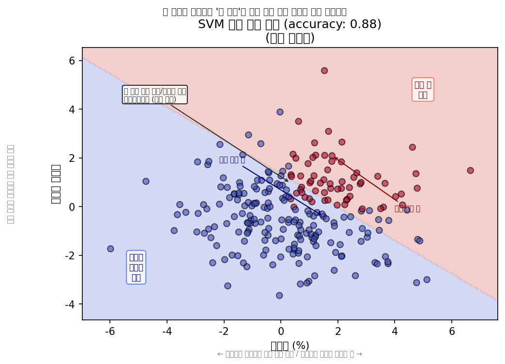

**무엇을 보여주나요?**
그래프가 **분홍색 구역**과 **파란색 구역**으로 나뉘어져 있고, 가운데 대각선이 경계선입니다.

- **빨간 점** = 매수 신호 (사야 할 타이밍)
- **파란 점** = 매도/보류 신호 (팔거나 기다려야 할 타이밍)
- **대각선 경계** = SVM이 찾아낸 "사야 할지 말아야 할지" 기준선

> 모멘텀이 높고(오른쪽) 거래량 변화율이 높을(위쪽) 수록 매수 신호가 됩니다.

---

### SvmMarketPhase_078935_KS.png — RSI/MACD 기반 시장 국면 예측

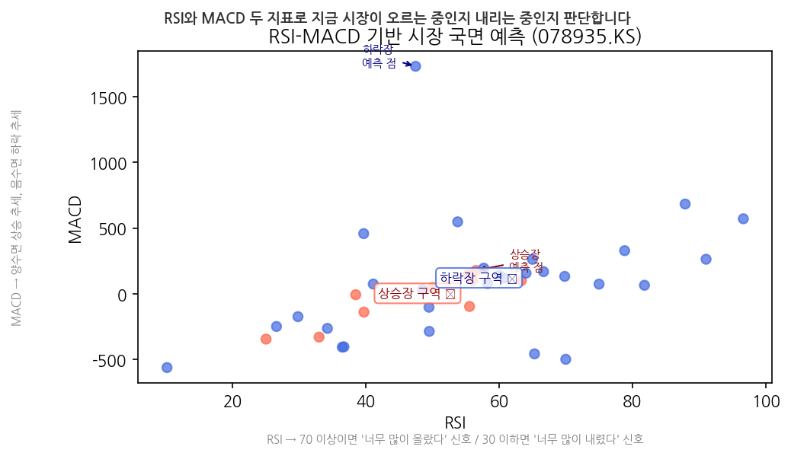

**무엇을 보여주나요?**
가로축은 RSI(과매수/과매도 지표), 세로축은 MACD(추세 강도 지표)입니다.

- **빨간 점** = 상승장으로 예측된 날
- **파란 점** = 하락장으로 예측된 날

> RSI가 높고(60 이상) MACD가 양수일 때 빨간 점이 집중되어 있습니다.

---

### NeuralNetBackprop_078935_KS.png — 신경망 역전파 주가 예측 결과

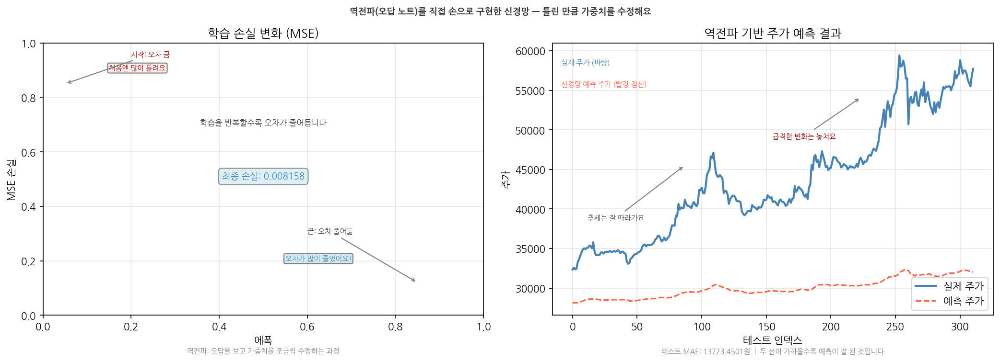

**무엇을 보여주나요?**
파란 실선(실제 주가)과 주황 점선(예측 주가)을 비교합니다.

> 신경망은 **전체적인 방향(추세)**은 잘 잡지만, **단기 급등락**은 놓칩니다.

---

### HeatmapRiskMask.png — 수익률 히트맵 & 고위험 마스킹

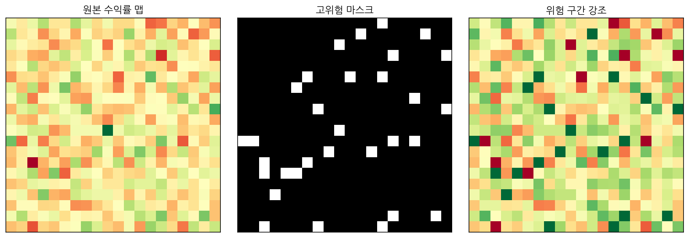

| 패널 | 내용 |
|------|------|
| **왼쪽 (원본)** | 초록=수익, 빨강=손실로 색칠한 원본 수익률 지도 |
| **가운데 (마스크)** | 수익률이 ±2% 초과인 위험 칸만 흰색으로 표시 |
| **오른쪽 (강조)** | 위험 칸을 더 진한 색으로 강조 |

---

### KMeansStockCluster.png — K-Means 주식 유형 자동 분류

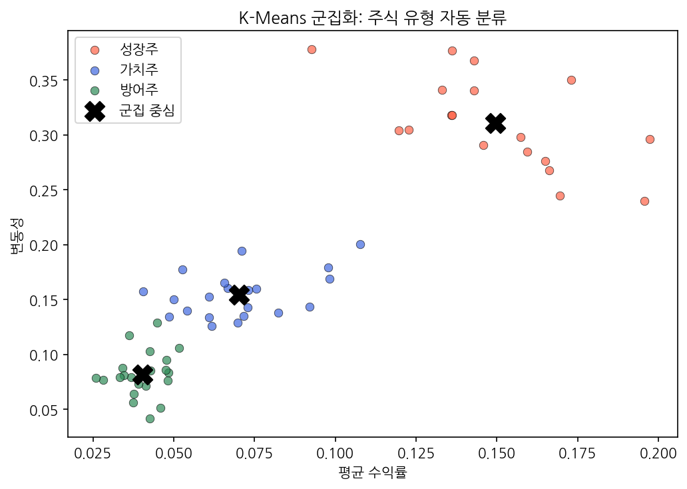

- **빨간 점 (성장주)** = 수익률 높고 변동성도 높음
- **파란 점 (가치주)** = 수익률·변동성 모두 중간
- **초록 점 (방어주)** = 수익률 낮지만 변동성도 낮음
- **검정 X** = 각 그룹의 중심점(centroid)

---

### PcaStockReduce.png — PCA 차원 축소 결과

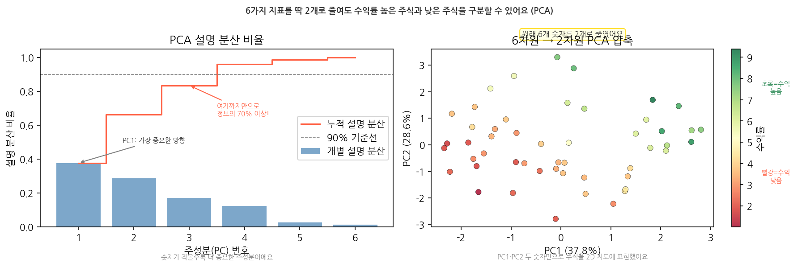

- 왼쪽: 각 주성분이 전체 정보의 몇 %를 담고 있는지
- 오른쪽: 6차원 지표를 2차원으로 압축한 산점도 (색깔=수익률)

---

### TimeSeriesAnalysis_078935_KS.png — 시계열 분석 종합

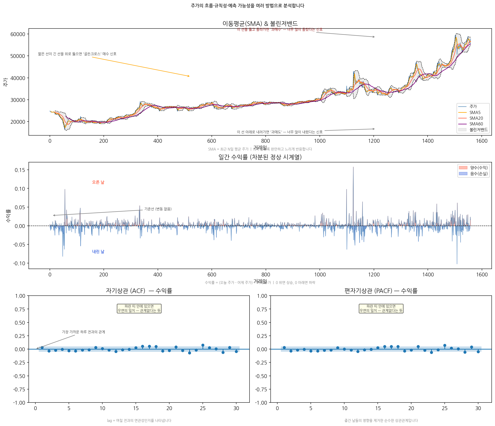

- **1행:** 이동평균(SMA5/20/60) & 볼린저밴드
- **2행:** 일간 수익률 (차분 결과)
- **3행:** ACF & PACF (ARIMA 차수 결정 힌트)

---

### ArimaStockForecast_078935_KS.png — ARIMA 주가 예측

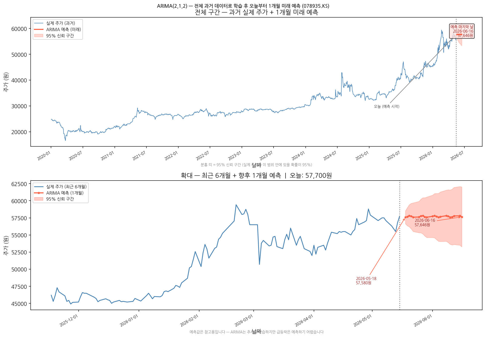

- **위 패널:** 전체 과거 주가 + 22거래일 미래 예측 + 95% 신뢰 구간(분홍 띠)
- **아래 패널:** 최근 6개월 확대 + 예측 마커

---

### RnnBackprop_078935_KS.png — 바닐라 RNN 학습 결과

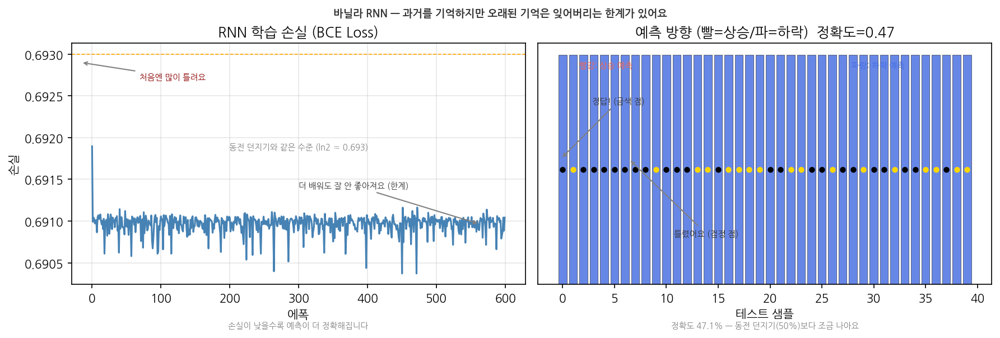

- **왼쪽:** BCE 손실 곡선 (0.693 근처에서 시작 → 기울기 소실 한계)
- **오른쪽:** 예측 방향 막대 (금색=정답, 검정=오답)

---

### LstmStockPyTorch_078935_KS.png — PyTorch LSTM 주가 예측

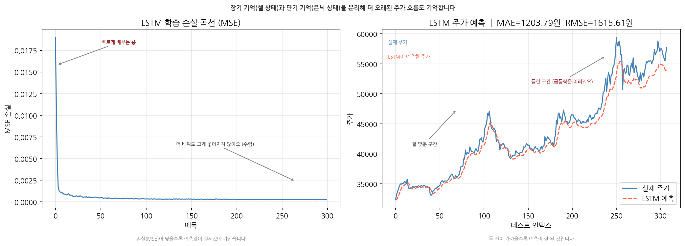

- **왼쪽:** MSE 손실 곡선 (수직 낙하 후 수렴)
- **오른쪽:** 실제(파랑) vs LSTM 예측(빨강) 비교

---

### LogisticTradeSignal_078935_KS.png — 로지스틱 회귀 매수/매도

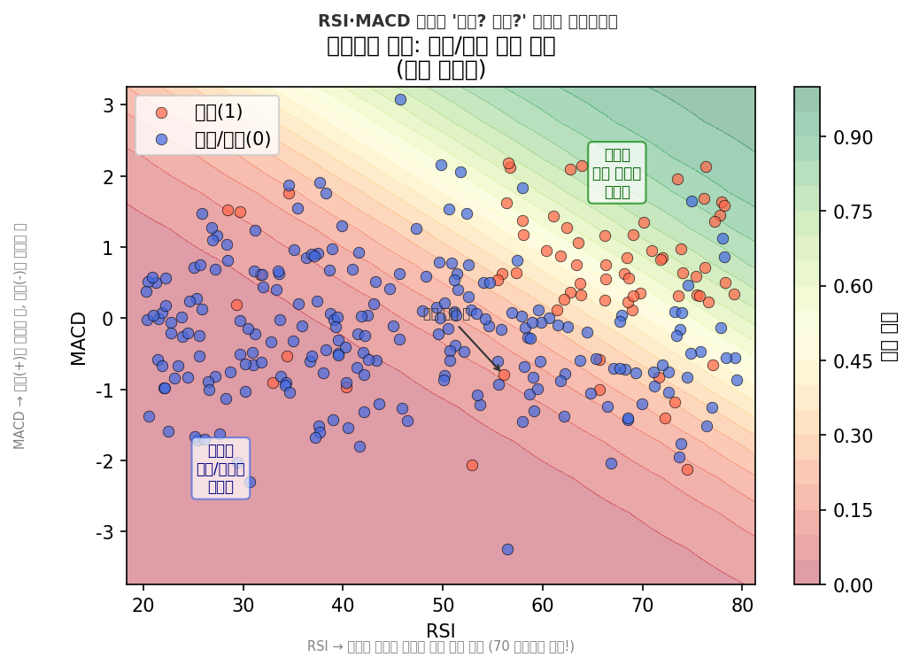

- **초록 배경:** 매수 확률이 높은 구역
- **빨간 배경:** 매도/관망 확률이 높은 구역

---

### CnnTimeSeriesFeature_078935_KS.png — 1D CNN 시계열 특징 추출

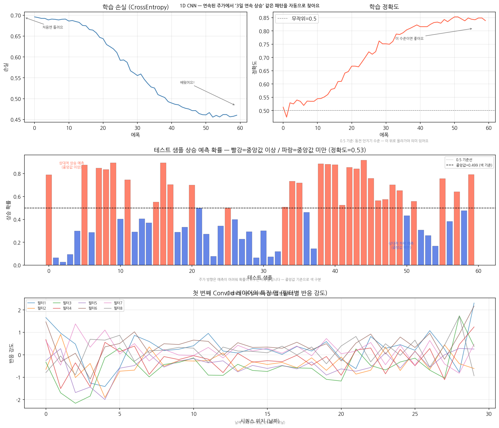

- 학습 손실·정확도 + 예측 확률 막대 + Conv1d 특징 맵 4패널

---

### CnnCandleChart_078935_KS.png — 2D CNN 캔들차트 이미지 분류

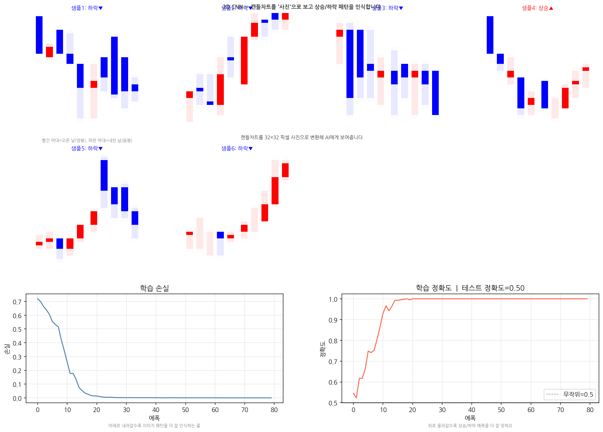

- 캔들차트 샘플 이미지 6장 + 학습 손실·정확도

---

### CnnLstmHybrid_078935_KS.png — CNN+LSTM 하이브리드 분류

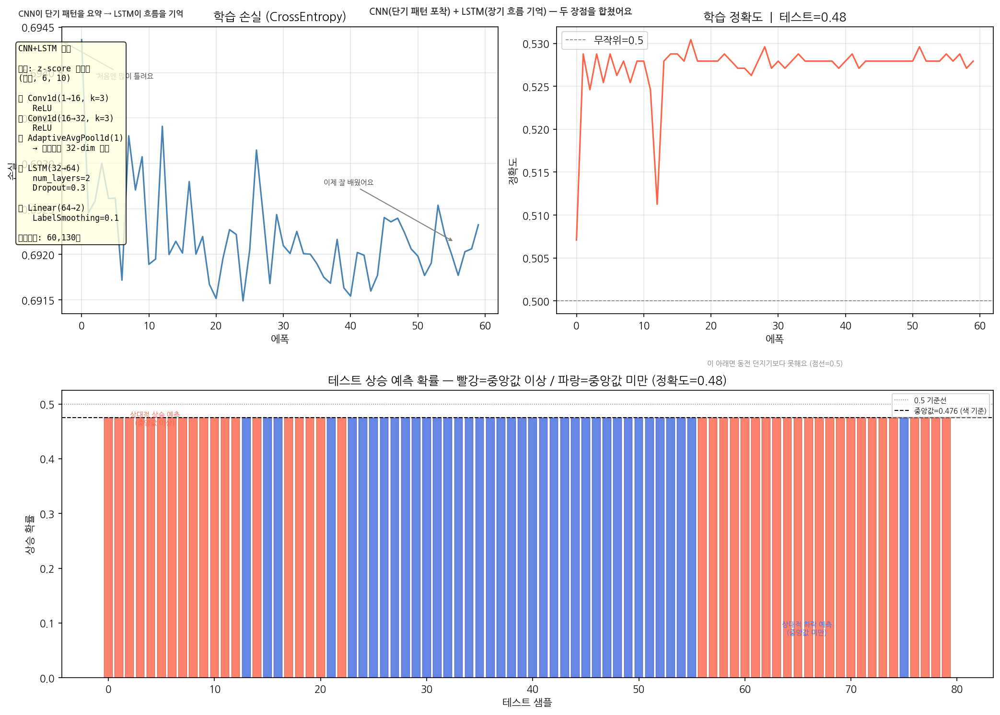

- CNN(단기 패턴) → LSTM(시간 흐름) → Linear(분류) 구조

---

### TransformerAttention_078935_KS.png — Transformer Self-Attention

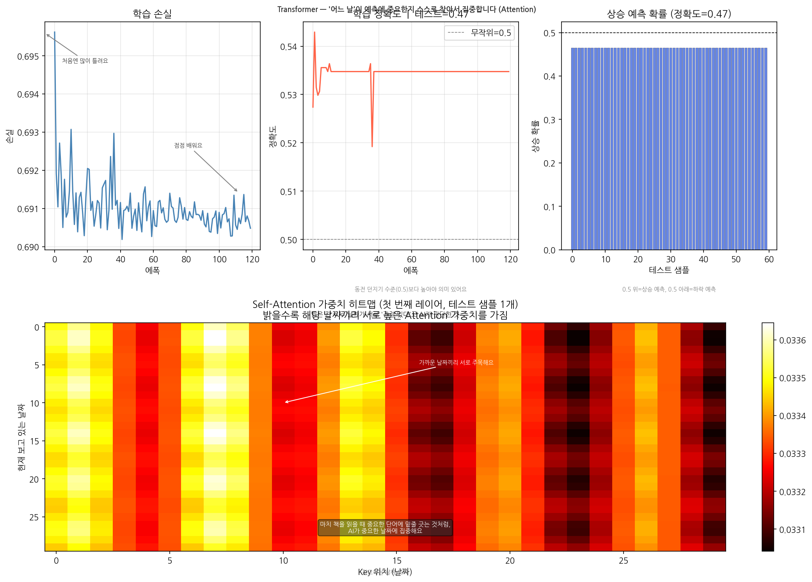

- **Self-Attention 히트맵:** 모델이 어느 날짜를 참고해 예측하는지 시각화

---

### HyperparamTuning.png — 하이퍼파라미터 튜닝 & 검증

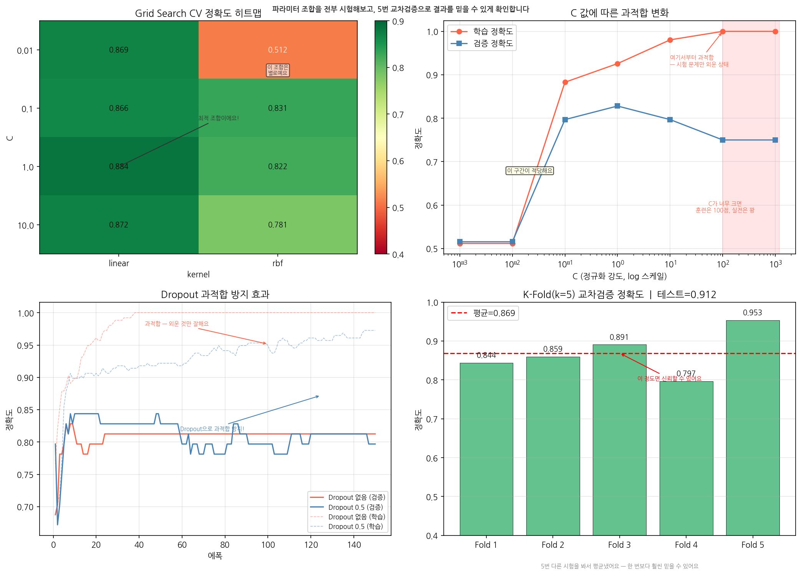

- Grid Search 히트맵 + C값 과적합 곡선 + Dropout 효과 + K-Fold 결과

---

### YfinanceNormalize_078935_KS.png — yfinance 정규화 비교

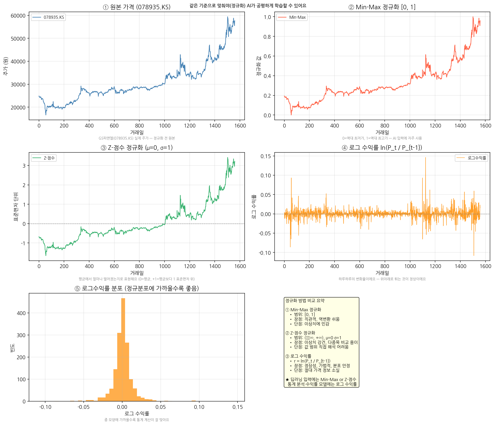

- 원본 / Min-Max / Z-점수 / 로그수익률 / 분포 5패널 비교

---

### TimeSeriesWindow_078935_KS_w20_h5.png — 시계열 윈도우 예측

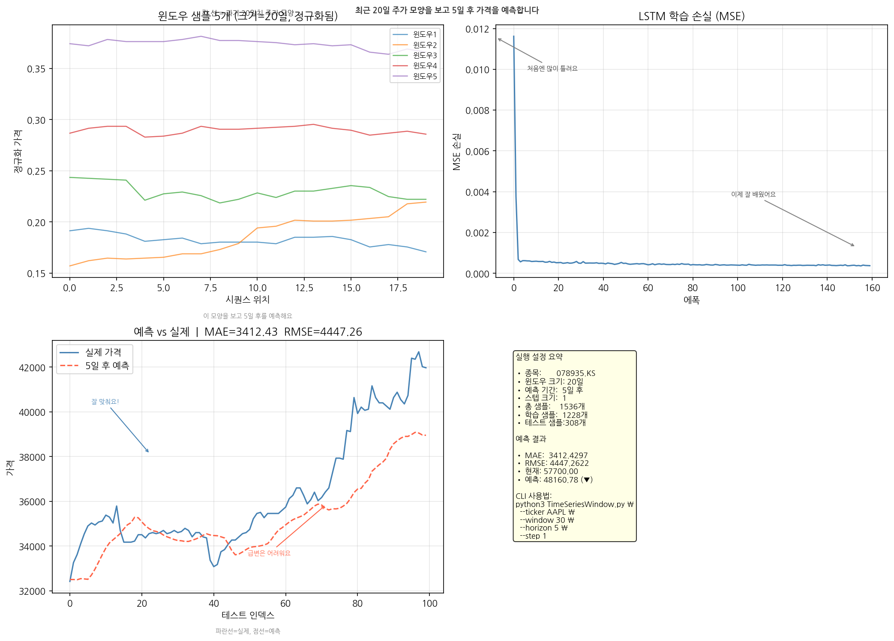

- 윈도우 샘플 + LSTM 손실 + 예측 vs 실제 + 실행 설정 요약 4패널
